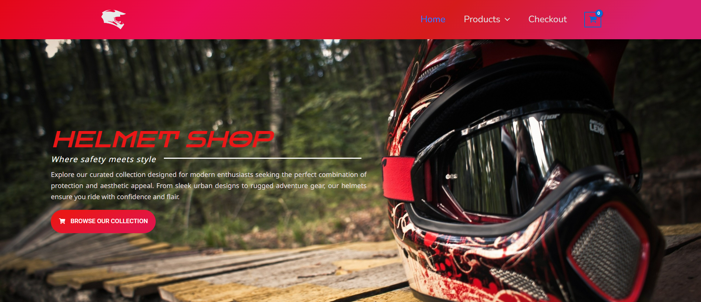

Helmet Shop Website

 

> An e-commerce website for helmets, built with **WordPress**, **Elementor**, and **Photoshop**. Fully responsive and visually appealing.

---

## 🚀 Features

- **Responsive Design** – Works on desktop, tablet, and mobile.
- **Custom Graphics** – Designed banners and product images in Photoshop.
- **Drag & Drop Editing** – Built using Elementor for easy customization.
- **Product Showcase** – Display helmets with images, descriptions, and prices.
- **Contact Form & Blog** – Easy communication with customers and share tips.
- **SEO Friendly** – Optimized for search engines.

---

## 🛠 Technologies Used

  
  
  
  
  

---

## 📸 Screenshots

<table>
  <tr>
    <td align="center">
       
      <b>Homepage</b>
    </td>
    <td align="center">
       
      <b>Products Page</b>
    </td>
    <td align="center">
       
      <b>Contact Page</b>
    </td>
  </tr>
  <tr>
    <td align="center">
       
      <b>Blog Section</b>
    </td>

  </tr>
</table>

---

## ⚙️ Installation & Setup

1. Install WordPress on your server or local environment.
2. Upload and activate a WordPress theme.
3. Install the **Elementor** plugin.
4. Import pre-designed pages and upload your **Photoshop images**.
5. Configure plugins for SEO, forms, and security.
6. Add products using WooCommerce (optional).
7. Customize design with Elementor drag-and-drop editor.

---

## 📂 Usage

- **Edit Pages** – Open in Elementor → Drag & drop widgets → Update content.  
- **Add Products** – WordPress Dashboard → Products → Add New.  
- **Update Images** – Replace Photoshop images in Media Library → Update page sections.

---

## 📌 Notes

- Backup your site before updates.  
- Optimize images for faster page load.  
- Keep WordPress, Elementor, and plugins up to date.

---

## 🔗 Links

- **Live Demo**: [Insert live link here]  
- **WordPress**: [https://wordpress.org](https://wordpress.org)  
- **Elementor**: [https://elementor.com](https://elementor.com)  
- **Adobe Photoshop**: [https://www.adobe.com/products/photoshop.html](https://www.adobe.com/products/photoshop.html)
